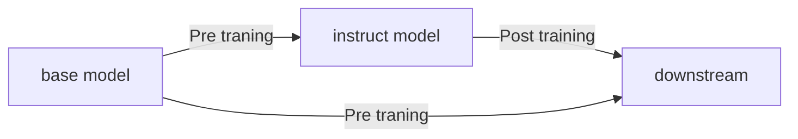
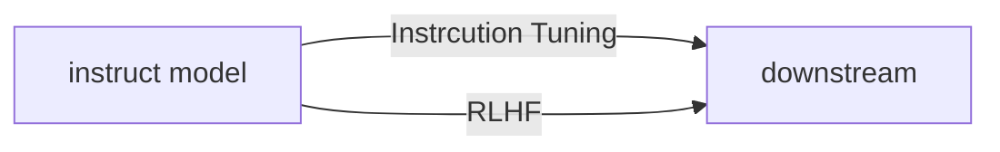
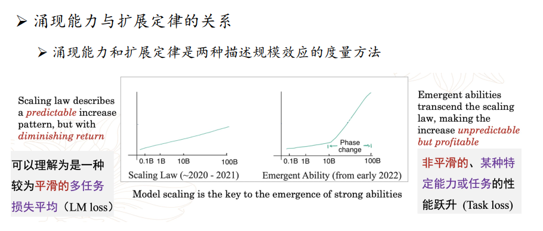

# 大模型发展背景

## 什么是语言模型？

语言模型是对自然语言文本的概率分布进行建模，具体来说是计算一串字符串(序列)的出现概率，或者给定前文预测后继词的条件概率。

## 从SLM到NNLM

[统计语言模型](https://ilewseu.github.io/2018/05/07/%E8%AF%AD%E8%A8%80%E6%A8%A1%E5%9E%8B/)(Statistical language model,SLM)模型时期：基于概率论和统计学。

- n-gram ：基于马尔可夫假设，认为当前词只依赖于前面n-1个词。
- Corpus（语料库）： 用于训练的文本集合。
- Vocabulary（词表）： 文本中出现的去重单词集合。

**NNLM (Neural Network Language Model)：**首次引入**神经网络**，将单词从离散的概率分布转为**低维稠密向量 (Embedding)**。

- 意义：引入了[语义空间](https://www.zhihu.com/question/561584849)的概念，使得单词相似度可度量，解决了SLM的维度灾难。

## word2Vec为什么重要？

word2vec是对NNLM的极大简化，去除了耗时的隐层计算，利用分布式假设，在大规模无监督语料中学习了词的语义表征。

- 典型方法：
  - CBOW(Continuous Bag of words): 通过上下文预测中间词
  - Skip-gram: 过中间词预测上下文。

- 局限性：
  - 多义性缺失： 属于**静态嵌入 (Static Embedding)**，一个词对应一个固定向量。

## **PLM，动态嵌入**

该模型引入了新的概念context，**动态嵌入 (Contextualized Embedding)：**  **区别：** 与 Word2Vec 不同，PLM 根据周围句子环境**实时计算**向量。同一个词（如 Bush）在不同语境下的向量是不同的。

- 定义：context是可观察的输入，语义关系是基于context种衍生的潜在结构，例如`king - queen` 和`man - woman`两组单词对在语义空间十分相似。
- Local vs Global ： 建议区分local context （滑动窗口内的临近词，）和 global context(整个语义上下文)

根据PLM的架构方法可以分为2种主要方法：

1. 自回归 autoregressive model 
   - 该类模型的理论假设是预测next token ，擅长生成任务和长文本逻辑。代表为GPT、GPT-2。只有在规模（Scale）跨越阈值后，才会产生**涌现能力 (Emergent Abilities)**。

2. 自编码器 autoencoder model
   - 该类模型是基于Masked language modeling，代表为BERT，模型在预测被遮掩的词时，可以同时“看到”左边和右边的信息，进而预测掩码值。

早期PLM的局限性

- **缺乏背景知识：** 仅靠文本统计，难以理解物理世界规律（常识）需要知识图谱等外部知识源来补充
- **任务泛化性较差：** 早期基座模型（如 BERT）通常需要针对下游任务进行复杂的**微调 (Fine-tuning)**。
- **推理能力弱：** 缺乏逻辑链条，难以处理多步复杂的数学或常识推理。

# 什么是大模型？

什么是大模型？具有超大规模参数的预训练模型。

架构：transformer解码器架构。

## 为什么注意大模型？

因为大模型在参数、数据量扩展到一定量级，**特定任务性能显著跃升，远超随机水平，引起关注**。表现为可以通过instruction following、in-context learning、step-by-step reasoning等方法提高推理能力。

## 大模型训练的概览

> token: 词元。token是AI模型处理语言的最小基元，通常由4个字符组成。word是自然语言的语义单元，将token转为word称为tokenization，辅助AI理解人类语言。
>
> shot (example): AI learn a new task with the number of examples, with `zero-shot` requiring no examples and `Few-shot` using a small number of examples to guide.
>
> 参数单位：B 十亿，例如70B，7百亿参数。

Post-Training后训练方法

- Instruction Tuning：使用指令数据对模型进行微调。
- Human Alignment：将model output 和human expectation、demand and value alignment
  - RLHF(Reinforcement Learning from Human Feedback):基于人类反馈的强化学习方法。

> SFT: supervised Fine-Tuning: 有监督微调。可以让模型规矩、格式化。
>
> RL：Reinforce leering，激发推理能力。

## scaling law and emergency ability

scaling law (扩展能力)：参数规模、数据规模和计算算力提升，LLM能力显著提升。

为什么需要scaling law：分析参数规模、数据质量、计算算力的关系，用于预估提高变量对输出效果的影响。

涌现能力：小模型不存在，但在大模型中出现的能力。(均已在实践中有使用到。)

- Instruction Following ：LLM可以按照自然语言指令来执行任务。例如`Instruction finetuing` and `Chain-of-thougt finetuning`、`Multi-task instruction finetuing`
- `In-context Learning`: 为model提供自然语言指令和任务示例,可以得到好的效果。
- step-by-step Reasoning:在prompt提示词中引入任务相关的中间推理步骤来加强复杂任务的求解。

如何激发模型能力？

- fine-tuning、human-alignment、prompt engineering

## 大模型调教工具

### LLM微调

为什么需要微调？

fine-tuning是大模型后训练的关键步骤，可以增强执行任务指令能力，提升任务泛化能力。

什么是LORA(Low-Rank Adaptation）: 模型轻量微调方法，通过为模型的不分层添加可训练的低秩矩阵模型。

> 不同任务需要设计不同的instruction-generation strategy。

为什么需要轻量化微调？

减少模型训练参数量，降低显存占用。

Lora广泛应用，其是一个adapter。

### 提示学习

#### what is prompt engineering?

它是自然语言与大模型交互的接口，可以激发大模型的涌现能力。

#### what is in-context learning?

使用task description + example来作为提示。研究发现example的selection、sequence and number对模型输出性能造成显著影响。

训练任务：设计专门的设计任务，预训练数据的多样性和长程依赖关系，以及高密度低频长尾词汇。

> long-tail: 一种语言中，绝大多数语言出现次数小。长尾指的是频率低。
>
> low-frequency：出现频率低。
>
> 在大语言模型中，这些词汇激活能较低，在处理过程中被高频数据掩盖，因此可能无法激活该特定词汇。表现为专业术语。

#### what is CoT?

思维链是指在input和output之间添加思维链，现实它的中间推理步骤。目前主流模型已经支持zero-shot的思维链，可以在prompt中显示提示来声明思维链的输出。

然后问题在于，一旦中间步骤出错，导致结果也错误，于是衍生出以下方法。

- 基于采样的方法：生成多条推理路径和对应的答案，集成并获得最终答案。
- 基于验证的方法：
- 思维树(Tree of Thout,TOT):叶子节点出现错误，则回溯为父节点。
- 思维图(Graph of Thout,GoT): 图结构支持更加复杂的推理关系。

> 思维链的训练离不开强化学习。

### RAG

大小模型知识能力的差距体现在长尾知识上。

RAG可以辅助补充，类似于BERT+Knowledge Graph，是一个时代使用的工具。

### 规划与智能体

为什么需要规划？

- 在提示学习中，有思维链和上下文学习，但中间步骤容易出错，无法进行校验与修改，需要引入更好的规划策略和反思检查策略。
- 知识时效性不足，需要额外的工具支持，例如RAG
- 提示词工程、上下文学习等信息一旦模型对话重启，就会忘记，需要记忆组件支持，记录模型的会话历史，以及中间运行结果。

于是引发基于大语言模型的规划功能。

- 迭代式的方案生成：基于历史动作和当前环境的反馈，逐步规划下一步执行动作。不同于单一输出，而遵循思考、行动(动作)、观察（反馈)、再思考的循环。
  - 典型方法：React。
  - 也有可能犯错误，通过历史记录信息、外部反馈或者内部反馈，采用回溯的思想来回退。

### Agent的智能在哪里？

Agent：通过人工智能模型与其环境交互以实现用户定义的目标的系统。

Agent  = LLM+Planing + Memory + Tool Use

- 瓶颈不在于工具调用，而是对LLM幻觉和错误的控制、回溯。
- 推理成本高。

# 参考

[PPT来源:大语言模型](https://github.com/LLMBook-zh/LLMBook-zh.github.io/tree/main)

[分布式单词表示综述](https://jiafengguo.github.io/2017/2017-A%20Survey%20on%20Distributed%20Word%20Representation..pdf)

[什么是上下文？](https://www.zhihu.com/question/658533833)